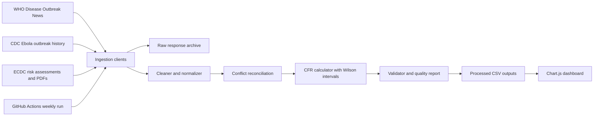

# outbreak-tracker


[]

[](https://github.com/vrsabha/outbreak-tracker/actions/workflows/update.yml)

`outbreak-tracker` is an open-source public health data pipeline that collects outbreak records from WHO Disease Outbreak News, CDC Ebola history, and ECDC rapid risk assessments; reconciles conflicting counts; calculates case fatality rates with confidence intervals; and publishes clean CSV outputs plus a self-contained Chart.js dashboard. It is designed for data engineers, researchers, journalists, and public health analysts who need transparent, reproducible outbreak data rather than a black-box spreadsheet.


## Architecture



## Quickstart

```bash
git clone https://github.com/vrsabha/outbreak-tracker.git
cd outbreak-tracker
pip install -r requirements.txt && python main.py
```

To run one disease only:

```bash
python main.py --disease Ebola
```

For a no-write smoke test:

```bash
python main.py --dry-run
```

## Data Sources

- WHO Disease Outbreak News: https://www.who.int/emergencies/disease-outbreak-news
- CDC Ebola outbreak history: https://www.cdc.gov/ebola/outbreaks/index.html
- ECDC publications and rapid risk assessments: https://www.ecdc.europa.eu/en/publications-data

All raw WHO, CDC, and ECDC responses are archived under `data/raw/` with ISO-like UTC timestamps. Cleaned outputs are written to `data/processed/outbreaks_clean.csv` and disease-specific CSV files.

## Data Schema

| Field | Type | Example | Definition |
| --- | --- | --- | --- |
| `disease` | string | `Ebola` | Canonical disease label. |
| `country` | string | `DRC` | Normalized country or region. |
| `date` | date | `1976-01-01` | Outbreak or publication date when only year-level precision is available. |
| `strain` | string | `Zaire` | Normalized strain, virus species, or clade. |
| `confirmed_cases` | integer | `318` | Confirmed case count used for analysis. |
| `suspected_cases` | integer | `42` | Suspected case count where available. |
| `deaths` | integer | `280` | Reported deaths. |
| `cfr` | float | `0.8805` | Case fatality rate, calculated as deaths divided by confirmed cases. |
| `cfr_ci_lower` | float | `0.8399` | Lower 95% Wilson confidence bound. |
| `cfr_ci_upper` | float | `0.9120` | Upper 95% Wilson confidence bound. |
| `statistically_unreliable` | boolean | `false` | True when confirmed cases are below 10. |
| `is_provisional` | boolean | `true` | True for ongoing or explicitly provisional outbreaks. |
| `data_conflict` | boolean | `true` | True when source counts differ by more than 10%. |
| `source_primary` | string | `WHO` | Source selected as primary after reconciliation. |
| `source` | string | `WHO` | Original record source. |
| `source_url` | string | `https://...` | URL for the source page. |
| `retrieved_at` | datetime | `2026-05-19T09:00:00Z` | UTC retrieval timestamp. |
| `updated_at` | datetime/date | `2025-10-16` | Source publication or update date. |
| `notes` | string | `Disease Outbreak News title` | Short provenance note. |
| `ambiguous_fields` | string | `confirmed_cases; deaths` | Fields that were missing or ambiguous during extraction. |

## Known Data Quality Issues

Historical outbreak reporting is inconsistent across agencies, especially where older records mix suspected and confirmed cases. WHO Disease Outbreak News pages are narrative documents, so count extraction can be ambiguous when several cumulative figures appear in one article. ECDC rapid risk assessments are primarily risk documents, not canonical line lists, and are best treated as cross-references. The pipeline flags ambiguity, documents material conflicts in `data/changelog.md`, and emits a quality report rather than silently dropping imperfect records.

## Dashboard

Open `dashboard/index.html` through a local web server after generating data:

```bash
python -m http.server 8000
```

Then visit `http://localhost:8000/dashboard/`. The dashboard loads `data/processed/outbreaks_clean.csv` when available and falls back to an embedded sample dataset for static hosting demos.

## Testing

```bash
pytest --cov=transform --cov-fail-under=80
```

`main.py` runs the test suite before live ingestion by default. Use `--skip-tests` only inside trusted automation where tests have already run.

## Contributing

Contributions are welcome. Please keep changes small, typed, tested, and explicit about data judgment calls. New sources should archive raw responses, preserve provenance, and add tests for parser edge cases. Data corrections should include a changelog entry explaining why the correction is justified and which source supports it.

## Citation

If you use this dataset in research, journalism, or analysis, cite it as:

> outbreak-tracker contributors. `outbreak-tracker`: an open-source public health outbreak data pipeline. Version by access date. Available at: https://github.com/vrsabha/outbreak-tracker

## License

This project is released under the MIT License. See `LICENSE` for details.
